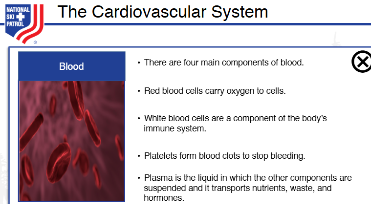
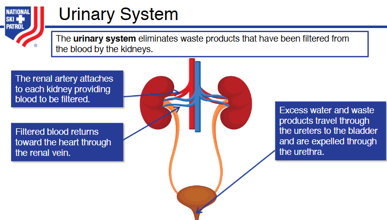

# Nsp Oec Training Chapter 6 - NSP_OEC_Training_Chapter_6
NSP_OEC_Training_Chapter_6

Chapter 6: Anatomy & Physiology

1. Identify and properly use each anatomic term for body direction, movement, and position.
2. Identify the location and function of each of the body's organs.
3. Describe the anatomy (structure) and physiology (functioning) of each body system.
4. Explain how blood flows through the heart.
5. Explain how tissue in the body gets oxygen and nourishment.
6. Name and describe the location of the major bones in the body.
7. Define and explain the three types of muscles.

Systems in the Human Body:

1. **Cardiovascular System**: Circulates blood throughout the body, delivering oxygen and nutrients to tissues and removing waste products.

2. **Digestive System**: Breaks down food into nutrients that can be absorbed and used by the body for energy, growth, and repair.

3. **Integumentary System**: Protects the body from environmental damage through the skin, hair, and nails, while regulating temperature and sensory perception.

4. **Nervous System**: Controls and coordinates body activities by transmitting signals between different body parts through the brain, spinal cord, and nerves.

5. **Skeletal System**: Provides structural support, protects internal organs, facilitates movement, and produces blood cells within bone marrow.

6. **Muscular System**: Allows movement of the body and its parts through the contraction and relaxation of muscles while also maintaining posture and generating heat.

7. **Respiratory System**: Facilitates the exchange of oxygen and carbon dioxide between the body and the environment through the lungs and airways.

8. **Endocrine System**: Produces and releases hormones that regulate metabolism, growth, reproduction, and other bodily functions.

9. **Lymphatic (and Immune) System**: Defends the body against infections, removes waste and toxins, and transports lymph, a fluid containing infection-fighting white blood cells.

10. **Urinary (Excretory) System**: Filters waste products from the blood and removes them from the body in the form of urine, while also maintaining fluid and electrolyte balance.

11. **Excretory System**: Eliminates metabolic waste products and toxins from the body through processes in the skin, lungs, liver, and kidneys.

11. **Reproductive System**: Enables the production of offspring through the creation and delivery of reproductive cells.

These systems work together to maintain the body's overall homeostasis and functionality.

## Getting Started
To get started with the **Nsp Oec Training Chapter 6** solution repository, follow these steps:
1. Clone the repository to your local machine.
2. Install the required dependencies listed at the top of the notebook.
3. Explore the example code provided in the repository and experiment.
4. Run the notebook and make it your own - **EASY !**
    
## Solution Features
- Easy to understand and use  
- Easily Configurable 
- Quickly start your project with pre-built templates
- Its Fast and Automated

## Notebook Features
- **Self Documenting** - Automatically identifes major steps in notebook 
- **Self Testing** - Unit Testing for each function
- **Easily Configurable** - Easily modify with **config.INI** - keyname value pairs
- **Includes Talking Code** - The code explains itself 
- **Self Logging** - Enhanced python standard logging   
- **Self Debugging** - Enhanced python standard debugging
- **Low Code** - or - No Code  - Most solutions are under 50 lines of code
- **Educational** - Includes educational dialogue and background material
    
## Deliverables or Figures
                                        
    

## Github    
## https://github.com/JoeEberle/ 

## Email 
## josepheberle@outlook.com 

    

    