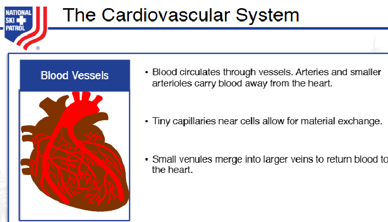
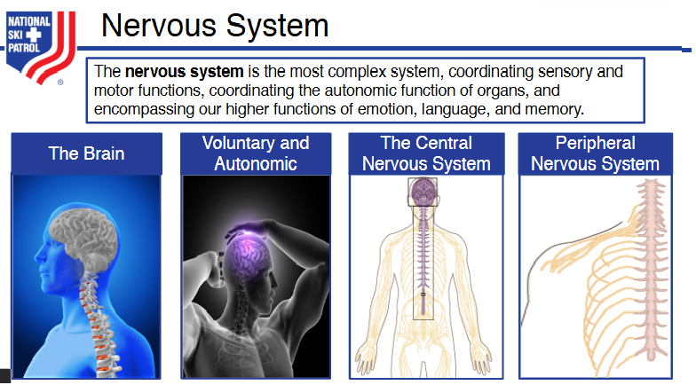
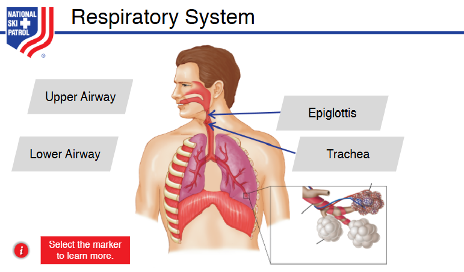

# Nsp Oec Training Chapter 6 - NSP_OEC_Training_Chapter_6
NSP_OEC_Training_Chapter_6

Chapter 6: Anatomy & Physiology

1. Identify and properly use each anatomic term for body direction, movement, and position.
2. Identify the location and function of each of the body's organs.
3. Describe the anatomy (structure) and physiology (functioning) of each body system.
4. Explain how blood flows through the heart.
5. Explain how tissue in the body gets oxygen and nourishment.
6. Name and describe the location of the major bones in the body.
7. Define and explain the three types of muscles.

## Systems in the Human Body:

1. **Cardiovascular System**: Circulates blood throughout the body, delivering oxygen and nutrients to tissues and removing waste products.
2. **Digestive System**: Breaks down food into nutrients that can be absorbed and used by the body for energy, growth, and repair.
3. **Integumentary System**: Protects the body from environmental damage through the skin, hair, and nails, while regulating temperature and sensory perception.
4. **Nervous System**: Controls and coordinates body activities by transmitting signals between different body parts through the brain, spinal cord, and nerves.
5. **Skeletal System**: Provides structural support, protects internal organs, facilitates movement, and produces blood cells within bone marrow.
6. **Muscular System**: Allows movement of the body and its parts through the contraction and relaxation of muscles while also maintaining posture and generating heat.
7. **Respiratory System**: Facilitates the exchange of oxygen and carbon dioxide between the body and the environment through the lungs and airways.
8. **Endocrine System**: Produces and releases hormones that regulate metabolism, growth, reproduction, and other bodily functions.
9. **Lymphatic (and Immune) System**: Defends the body against infections, removes waste and toxins, and transports lymph, a fluid containing infection-fighting white blood cells.
10. **Urinary (Excretory) System**: Filters waste products from the blood and removes them from the body in the form of urine, while also maintaining fluid and electrolyte balance.
11. **Excretory System**: Eliminates metabolic waste products and toxins from the body through processes in the skin, lungs, liver, and kidneys.
11. **Reproductive System**: Enables the production of offspring through the creation and delivery of reproductive cells.

These systems work together to maintain the body's overall homeostasis and functionality.

## Human body’s major organs, their location, and their function:

1. **Heart**: Located in the chest, between the lungs. It pumps blood throughout the body, supplying oxygen and nutrients while removing carbon dioxide and waste.
2. **Lungs**: Located on either side of the chest. They exchange oxygen from the air with carbon dioxide from the blood.
3. **Brain**: Located in the skull. It controls all body functions, including movement, thought, emotions, and sensory processing.
4. **Liver**: Located in the upper right abdomen. It processes nutrients, detoxifies harmful substances, and produces bile for digestion.
5. **Stomach**: Located in the upper abdomen, just below the ribs. It breaks down food using digestive acids and enzymes.
6. **Pancreas**: Located behind the stomach. It produces digestive enzymes and regulates blood sugar by releasing insulin and glucagon.
7. **Kidneys**: Located in the lower back, one on each side of the spine. They filter waste from the blood, regulate fluid balance, and produce urine.
8. **Small Intestine**: Located in the abdomen. It digests food and absorbs nutrients into the bloodstream.
9. **Large Intestine**: Located in the abdomen, surrounding the small intestine. It absorbs water and forms solid waste (stool).
10. **Spleen**: Located in the upper left abdomen. It filters blood, recycles old red blood cells, and helps the immune system.
11. **Gallbladder**: Located under the liver. It stores bile produced by the liver and releases it into the small intestine to aid in fat digestion.
12. **Bladder**: Located in the pelvis. It stores urine until it is expelled from the body.
13. **Esophagus**: Located in the chest, connecting the throat to the stomach. It carries food and liquids from the mouth to the stomach.
14. **Thyroid**: Located in the neck. It regulates metabolism, energy production, and growth through hormone production.
15. **Adrenal Glands**: Located on top of each kidney. They produce hormones like adrenaline and cortisol that regulate metabolism, stress response, and blood pressure.
16. **Skin**: Covers the entire body. It acts as a protective barrier, regulates temperature, and allows sensation.
17. **Bones**: Located throughout the body. They provide structural support, protect organs, and enable movement through muscle attachment.
18. **Muscles**: Located throughout the body. They enable movement, posture, and generate heat by contracting.
19. **Uterus (female)**: Located in the pelvis. It supports the development of a fetus during pregnancy.
20. **Prostate (male)**: Located below the bladder. It produces fluid that nourishes and protects sperm in semen.

These organs work together to maintain vital bodily functions.

## How Blood flows through the heart :

1. **Blood enters the heart** through the superior and inferior vena cava.
2. Deoxygenated blood **flows into the right atrium**.
3. The **right atrium contracts**, pushing blood through the tricuspid valve into the right ventricle.
4. The **right ventricle contracts**, sending blood through the pulmonary valve into the pulmonary arteries.
5. **Blood travels to the lungs**, where it picks up oxygen and releases carbon dioxide.
6. **Oxygenated blood returns** to the heart through the pulmonary veins into the left atrium.
7. The **left atrium contracts**, pushing blood through the mitral (bicuspid) valve into the left ventricle.
8. The **left ventricle contracts**, sending oxygenated blood through the aortic valve into the aorta.
9. **Blood is distributed** to the rest of the body through the aorta, delivering oxygen to tissues.

## Getting Started
To get started with the **Nsp Oec Training Chapter 6** solution repository, follow these steps:
1. Clone the repository to your local machine.
2. Install the required dependencies listed at the top of the notebook.
3. Explore the example code provided in the repository and experiment.
4. Run the notebook and make it your own - **EASY !**
    
## Solution Features
- Easy to understand and use  
- Easily Configurable 
- Quickly start your project with pre-built templates
- Its Fast and Automated

## Notebook Features
- **Self Documenting** - Automatically identifes major steps in notebook 
- **Self Testing** - Unit Testing for each function
- **Easily Configurable** - Easily modify with **config.INI** - keyname value pairs
- **Includes Talking Code** - The code explains itself 
- **Self Logging** - Enhanced python standard logging   
- **Self Debugging** - Enhanced python standard debugging
- **Low Code** - or - No Code  - Most solutions are under 50 lines of code
- **Educational** - Includes educational dialogue and background material
    
## Deliverables or Figures
                                        
    

## Github    
## https://github.com/JoeEberle/ 

## Email 
## josepheberle@outlook.com 

    

    